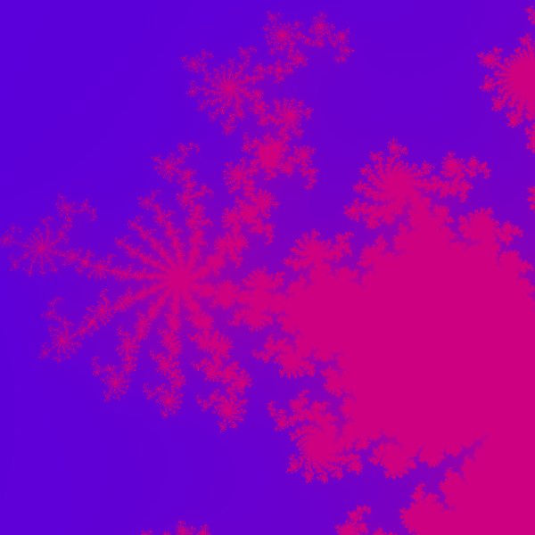

    using shaders to draw the Mandelbrot set

This was kind of easy to do, as all the heavy lifting is handled by the p5js library.\
I wanted to learn about shaders so did this in shaders.

## Running the simulation
- open using the p5js [cli](https://github.com/datejer/p5js-cli)
- open in p5js web-editor [here](https://editor.p5js.org/rajat_dahal/sketches/4iSecPfLC)

## Screenshots 
obtained by changing color vectors

## References
- https://en.wikipedia.org/wiki/Mandelbrot_set

I'll probably write about it in [here](https://rajatdahal.com.np/posts/2026/coding-the-mandelbrot-set/).
